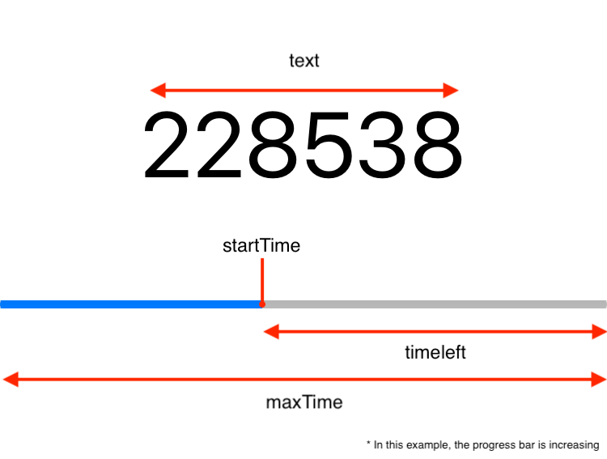

#  Progress Manager
A manager that receives a UILabel and a UIProgressView and updates their status accordingly to informations set on Progress Info

Ideal for token generation based on time (TOTP)

---
## Basic Usage

You can set the label and progressView you want to update along with the necessary info

```swift
let progressInfo = ProgressInfo(text: "000 000", startTime: Date(), timeleft: 10.0, maxTime: 10.0)
let progManager = ProgressManager(progressInfo: progressInfo, label: label, progressView: progressView)
progManager.start()
```

## Progress Info

`ProgressInfo` is the model that defines the information necessary for `ProgressManager`

```swift
struct ProgressInfo {
    let text: String
    let startTime: Date
    let timeleft: Double
    let maxTime: Double
}
```

In this model you define:
- `text` is used to update the label
- `startTime` works together with `timeleft`. The `timeleft` property is the amount of time (in seconds) left to finish the progress view in relation to `startTime`
- `maxTime` is maximum total time (in seconds) of the progress view

#### NOTE: If `timeleft` is bigger than maxTime or less than 0, it will not work.



## Personalizing

You can personalize the bar with things such as:
- direction: defines if the bar is increasing or decreasing
- smoothness: defines how smooth the progress bar will increasing or decrease
- shouldRestartAutomatically: if the progress bar will restart automatically after is finished

```swift
progManager.smoothness = .high
progManager.direction = .increasing
progManager.shouldRestartAutomatically = true
```

### IMPORTANT

If `shouldRestartAutomatically` is set as `true`, is important that you set the delegate for the manager, otherwise the it will NOT work.

```swift
progManager.delegate = self
```

Then, use the `ProgressManagerDelegate` protocol method `progressInfo(forProgressManager:)` to update the new `ProgressInfo` for `ProgressManager`

```swift
func progressInfo(forProgressManager progressManager: ProgressManager) -> ProgressInfo {
    return ProgressInfo(text: getRandomStringNumber(), startTime: Date(), timeleft: 9.0, maxTime: 10.0)
}
```

#### OR

Your can restart the progressView by will using

```swift
progManager.restart(withInfo:)
```
